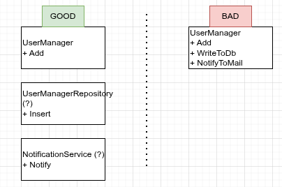

# solid-principles

> Данный репозиторий является конспектом для понимания принципов SOLID.

## Описание
### Что такое SOLID?
*SOLID* - это 5 принципов программирования, направленных на построение независимого, простого и легкоизменяегого продукта.
Данные принципы были придуманы совместно с сообществом разработчиков Робертом Мартиным (a.k.a дядюшка Боб).

### Принципы
#### Single Responsibility Principle

**Основная мысль:**
> У сущности должна быть только одна причина для изменения;

**Описание:**

Принцип заключается в том, что сущность при изменении не должна менять логику приложения в разных местах.

>Для простого понимания на живом примере: водитель не должен уметь ложить дорогу впереди себя, собирать машину, управлять климатом, водитель должен водить машину.

Условно, если взять за пример модуль управления пользователем, если быть точнее то метод добавления пользователя, то:
- метод не должен содержать логики добавления записи в БД;
- метод не должен содержать логики уведомления на почту о создании пользователя.

Метод должен только лишь управлять логикой того, как должен добавиться пользователь, и в случае изменений, изменится только логика добавления и ничего другого.


**Схема:**



**Пример кода**

```csharp
public class UserManager 
{
    // ... подтянем зависимости

    public async Task Add(User user, CancellationToken cancellationToken = default)
    {
        await _userManagerRepository.Add(user, cancellationToken);
        await _notificationService.Notify("User added");
    }
}

public class UserManagerRepository : IUserManagerRepository 
{
    // ...
}

public class NotificationService
{
    // ...
}

```

#### Open\Closed Principle
#### Liskov Substitution Principle
#### Interface Segregation Principle
#### Dependency Inversion Principle
