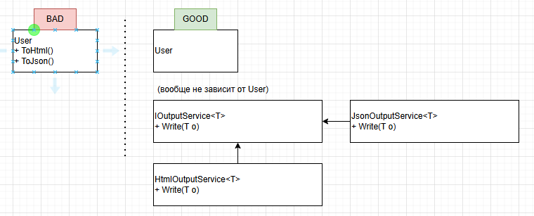

# solid-principles

> Данный репозиторий является конспектом для понимания принципов SOLID.

## Описание
### Что такое SOLID?
*SOLID* - это 5 принципов программирования, направленных на построение независимого, простого и легкоизменяегого продукта.
Данные принципы были придуманы совместно с сообществом разработчиков Робертом Мартиным (a.k.a дядюшка Боб).

### Принципы
#### Single Responsibility Principle

**Основная мысль:**
> У сущности должна быть только одна причина для изменения;

> [!CAUTION]
> Этот принцип означает не только, что сущность должна делать одно действие
> Точнее, то, что сущность должна делать одно действие, не относится к принципам SOLID

**Описание:**

Принцип заключается в том, что сущность при изменении не должна менять логику приложения в разных местах.

>Для простого понимания на живом примере: водитель не должен уметь ложить дорогу впереди себя, собирать машину, управлять климатом, водитель должен водить машину.

Условно, если взять за пример модуль управления пользователем, если быть точнее то метод добавления пользователя, то:
- метод не должен содержать логики добавления записи в БД;
- метод не должен содержать логики уведомления на почту о создании пользователя.

Принцип заключается в том, что модуль должен иметь одну ответственность и, как следствие, одну основную причину для изменения. Изменения, связанные с разными аспектами системы, должны быть изолированы друг от друга.


**Схема:**


**Пример кода**

```csharp
public class UserManager 
{
    // ... подтянем зависимости

    public async Task Add(User user, CancellationToken cancellationToken = default)
    {
        await _userManagerRepository.Add(user, cancellationToken);
        await _notificationService.Notify("User added");
    }
}

public class UserManagerRepository : IUserManagerRepository 
{
    // ...
}

public class NotificationService
{
    // ...
}

```

**Пример "неподходящего" кода**

```csharp
public class UserManager 
{
    public async Task Add(User user, CancellationToken cancellationToken = default)
    {
        await AddToDb.Add(user, cancellationToken);
        await NotifyToMail.Notify("User added");
    }

    public async Task AddToDb(User user, CancellationToken cancellationToken = default)
    {
        const string sql = "INSERT INTO USERS ...";
        // ... ответственность за БД
    }

    public async Task NotifyToMail(string message, CancellationToken cancellationToken = default)
    {
        // ... ответственность за уведомления на почту
    }
}


```

#### Open\Closed Principle
**Основная мысль:**
> Компонент должен быть открытым ДЛЯ РАСШИРЕНИЙ, но закрытым ДЛЯ ИЗМЕНЕНИЙ.

> Другими словами, компонент можно легко расширять, но изменить его нельзя.

**Описание:**

Принцип заключается в том, чтобы не переписывать компонент на новый лад при новых изменениях, а дополнять его.

Данное поведение можно достичь, придерживаясь принципа открытости\закрытости.

Банальный пример: различные вариации форматирования выходного текста.
Представим, что у нас есть задача: вывести сведения по пользователю в формате HTML.

Самый худший способ это сделать - инкапсулировать логику вывода данных напрямую в классе-пользователе, и назвать метод ToHtml();

Это худший способ потому что:
- при необходимости выводить в JSON необходимо будет добавлять новый метод также в пользователя, при этом HTML уже возможно будет не нужен, и что делать с данным кодом?
- при необходимости поменять вывод с HTML в JSON необходимо будет удалить старый код, написать новый, а также поменять название метода на ToJson

Звучит не очень. К тому же, нарушает первый принцип SOLID.

Вместо этого, можно использовать отдельно выделенный класс для вывода данных и отдельно выделенный интерфейс и реализации интерфейса, и в дальнейшем использовать их.

Таким образом, сущность пользователя не будет отвечать за вывод данных, и класс, отвечающий за вывод данных, не будет отвечать за конкретный вывод. 

**Схема:**


**Пример кода**
```csharp
var user = new User() { Name = "Oleg"};
IOutputService<User> printer = new HtmlOutputService();
Console.WriteLine(printer.Write(user));
printer = new JsonOutputService();
Console.WriteLine(printer.Write(user));

public class User
{
    public string Name { get; set; }
}

public interface IOutputService<T>
{
    string Write(T obj);
}

public class HtmlOutputService : IOutputService<User>
{
    public string Write(User obj)
    {
        var sb = new StringBuilder();

        sb.AppendLine("<div class='user'>");
        sb.AppendLine($"\t<label>Name: </label><p>{obj.Name}</p>");
        sb.AppendLine("<div/>");

        return sb.ToString();
    }
}

public class JsonOutputService : IOutputService<User>
{
    public string Write(User obj)
    {
        var sb = new StringBuilder();

        sb.AppendLine("{");
        sb.AppendLine($"\t\"name\": \"{obj.Name}\"");
        sb.AppendLine("}");

        return sb.ToString();
    }
}
```


**Пример "неподходящего" кода**
```csharp
var user = new User() { Name = "Oleg"};
Console.WriteLine(user.Write());

public class User
{
    public string Name { get; set; }
    public string Write()
    {
        var sb = new StringBuilder();

        sb.AppendLine("<div class='user'>");
        sb.AppendLine($"\t<label>Name: </label><p>{Name}</p>");
        sb.AppendLine("<div/>");

        return sb.ToString();
    }
}

```
#### Liskov Substitution Principle
#### Interface Segregation Principle
#### Dependency Inversion Principle
